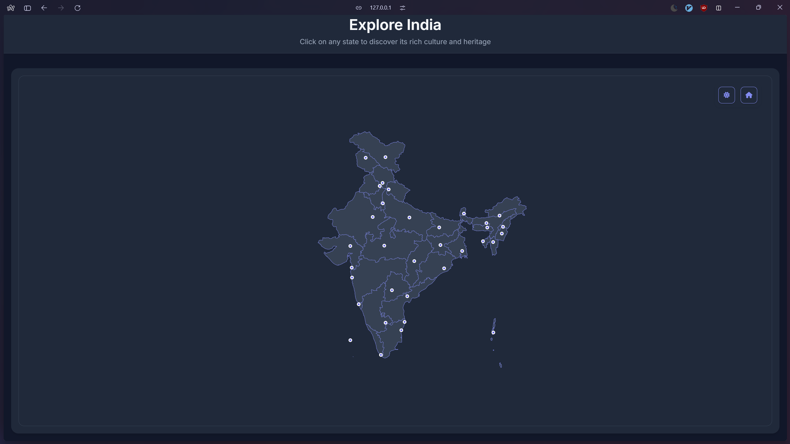

# Interactive India Map Explorer

An interactive web application built with Astro.js that visualizes India's states and union territories, providing detailed information about each region's culture, demographics and heritage.



## Website Link

Visit the live application at [Explore India Map](https://india-map.netlify.app).

## Features

- Interactive SVG map of India with clickable states
- State capitals marked with interactive markers
- Detailed modal view for each state showing:
  - Capital city
  - Area
  - Languages
  - Traditional dance forms
  - Literacy rate
  - Brief description
- Dark/Light theme toggle
- Responsive design
- Zoom and pan controls
- Copy state information functionality

## Getting Started

### Prerequisites

- Node.js 16+
- npm/yarn

### Installation

1. Clone the repository:

    ```bash
    git clone https://github.com/yourusername/assignment.git
    cd assignment
    git checkout origin/task/india-map
    ```

2. Install dependencies:

    ```bash
    npm install
    ```

3. Start development server:

    ```bash
    npm run dev
    ```

4. Start build server:

    ```bash
    npm run build
    npm run preview
    ```

    Deploy the `dist` directory to your preferred hosting service.

### Project Structure

```plaintext
/
├── src/
│   ├── components/
│   │   ├── Header.astro
│   │   ├── IndiaMap.astro
│   │   └── StateModal.astro
│   ├── layouts/
│   │   └── Layout.astro
│   ├── pages/
│   │   └── index.astro
│   └── styles/
│       ├── components/
│       │   ├── controls.css
│       │   ├── header.css
│       │   ├── map.css
│       │   ├── modal.css
│       │   └── themes.css
│       └── main.css
└── public/
    ├── data/
    │   ├── india.geojson
    │   └── state_data.json
    └── js/
        ├── config/
        │   └── mapConfig.js
        ├── modules/
        │   ├── IndiaMap.js
        │   ├── StateModal.js
        │   └── ThemeToggle.js
        └── main.js
```

## Technical Approach

### Architecture

- Built with Astro.js for static site generation
- D3.js for map visualization and interactions
- CSS variables for theming
- JSON data storage for state information

### Key Features Implementation

1. **Map Visualization**
   - Uses D3.js Mercator projection
   - SVG path elements for states
   - Interactive capital markers

2. **State Information**
   - Modal-based detail view
   - Copy to clipboard functionality
   - Rich cultural and demographic data

3. **User Interface**
   - Dark/Light theme switcher
   - Zoom controls
   - Responsive layout

### Key Design Decisions

1. **Component Structure**:
   - Astro components for static parts
   - JavaScript modules for interactive features
   - Separated concerns for better maintainability

2. **Responsive Design**:
   - Fluid layout that adapts to different screen sizes
   - Dynamic recalculation of map dimensions on window resize

3. **Performance Optimizations**:
   - Static site generation with Astro
   - Event delegation for map interactions
   - Efficient D3.js selections
   - Clean-up handlers to prevent memory leaks

## Areas for Improvement

1. **Performance**
    - Implement lazy loading for state data
    - Add caching for frequently accessed information
2. **Features**
    - Add search functionality
    - Include more detailed statistics
    - Add animation transitions between states
3. **Accessibility**
    - Enhance keyboard navigation
    - Add ARIA labels for better screen reader support
4. **Data**
    - Include historical data
    - Add economic indicators
    - Include population statistics

## Known Issues

1. Capital markers may overlap in densely populated regions
2. Zoom behavior needs fine-tuning when zooming out
3. Initial load might show a flash of unstyled content

## Acknowledgments

- D3.js community for visualization tools
- Indian government data portals for state information

## License

This project is licensed under the MIT License - see the [LICENSE](LICENSE) file for details.
