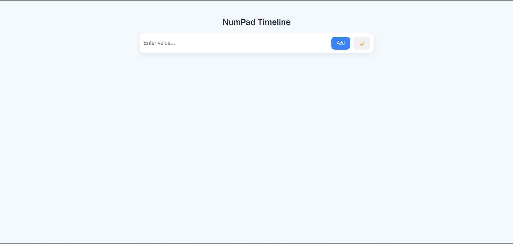
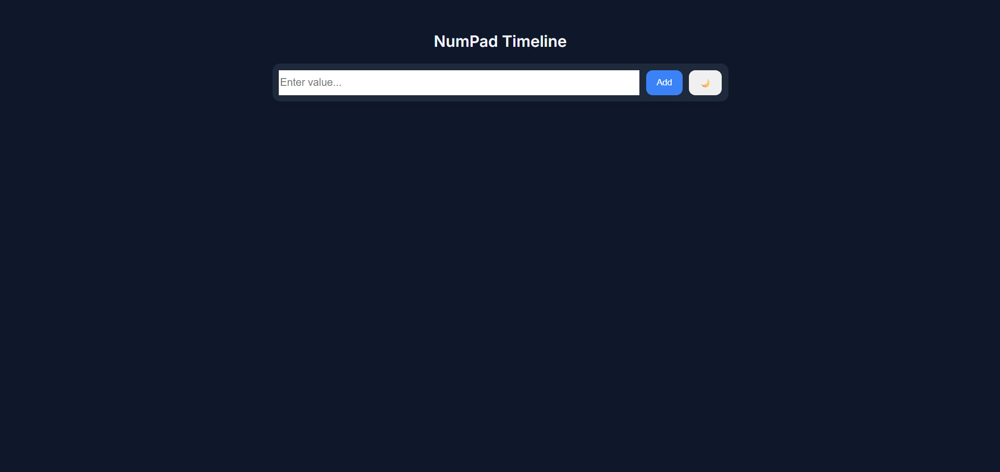
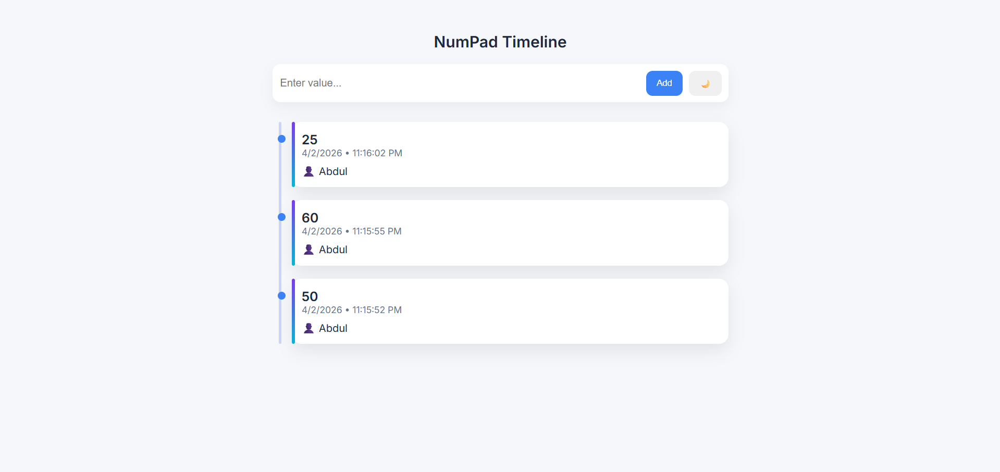

# NumPad

Below are assignment and task list. Each have separate branch name as `task/<assignment-title>`

---

## Objective

Create a dynamic and visually appealing webpage for an intern assignment with the following specifications.

---

## Requirements

1. **Input Handling:**
   - Allow users to input numbers or alphanumeric characters, no white space allowed.
   - Set a customizable maximum input length of 16 characters.
   - Restrict duplicate numbers.

2. **Timeline Display:**
   - Showcase entered numbers on a timeline.
   - Include posting details such as date, time, and the respective user's name.

3. **Aesthetics:**
   - Choose an appropriate font to enhance the visual appeal.
   - Implement dark and light themes using CSS root properties for a polished appearance.

4. **Responsiveness:**
   - Ensure mobile responsiveness for an optimal user experience.

---

## Deliverables

1. **Webpage Design**
2. **Codebase**
3. **User Guide**

---

## 🚀 How to Run the Project

### Using VS Code Live Server

1. Open the project in VS Code  
2. Install Live Server extension  
3. Right-click index.html  
4. Click "Open with Live Server"  

---

## 📸 Screenshots

### Light Mode

### Dark Mode

### Timeline View

---

## Assignment List

[BrandAddress](./docs/markdown/AuthenticInfo.md)  
[DateMatics](./docs/markdown/DateMatics.md)  
[DynImagic](./docs/markdown/DynImagic.md)  
[FamilyTree](./docs/markdown/FamilyTree.md)  
[HinDictionary](./docs/markdown/HinDictionary.md)  
[ImageSearch](./docs/markdown/ImageSearch.md)  
[DanceCase](./docs/markdown/DanceCase.md)  
[MaturityMatrix](./docs/markdown/MaturityMatrix.md)  
[NumPad](./docs/markdown/NumPad.md)  
[PNR](./docs/markdown/PNR_PWA.md)  
[SafeDocs](./docs/markdown/SafeDocs.md)  
[VoiceForm](./docs/markdown/VoiceForm.md)  
[Societree](./docs/markdown/Societree.md)  
[IndiaMap](./docs/markdown/IndiaMap.md)

---

## How to Submit

- Create a feature branch from `task/<assignment>`
- Create `feature/<assignment>`
- Commit your code
- Raise PR against `task/<assignment>`

---

## Contact

recursivezero@outlook.com