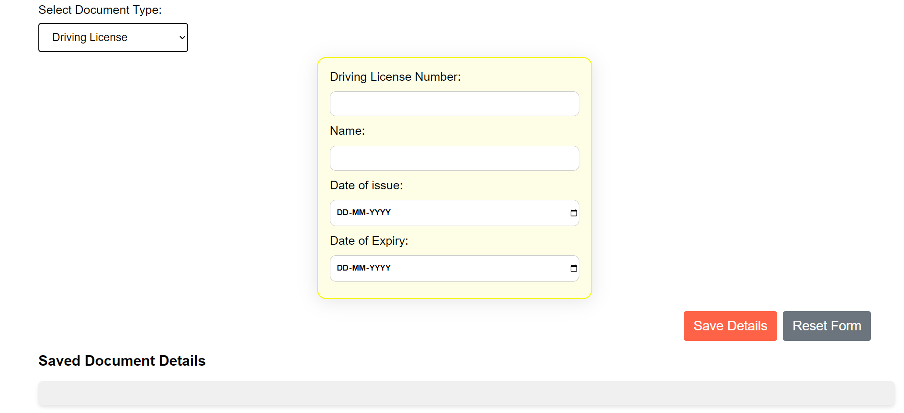
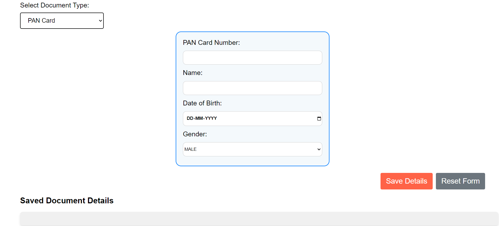
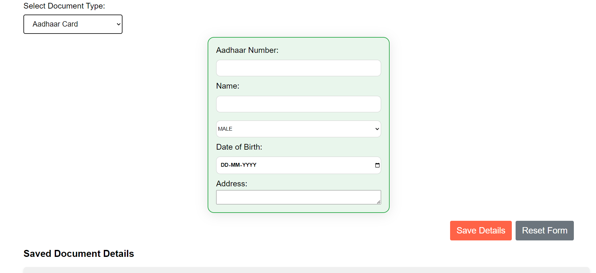
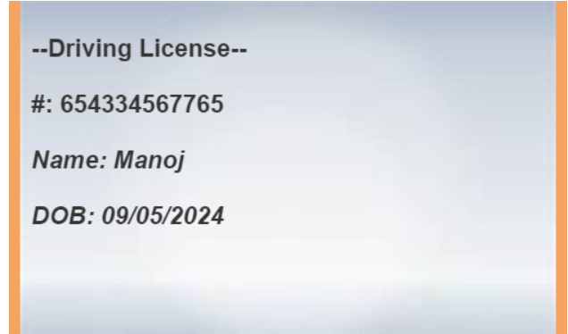
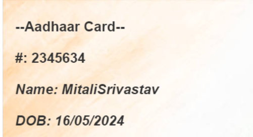

# Offline Document Storage
 An offline application to store and manage personal documents such as Aadhaar Card, Driving License, and PAN Card.

## Table of Contents
- [Installation]
- [Introduction]
- [Features]
- [Usage]
- [ProjectStructure]
- [Screenshot]
- [Conclusion]


## Installation

To set up the project, clone the repository and open the `index.html` file in your browser.

```bash
git clone "https://github.com/recursivezero/assigment.git"
cd " offline-document-storage"
Run directly in your vs code using golive Extensions.
```


## Introduction

-> The Offline Document Storage is a simple yet efficient tool designed to help users store and manage their important personal documents offline. It provides a user-friendly interface to add, view, edit, and delete document details.

## Features

- Add various document types including Aadhaar Card, Driving License, and PAN Card.
- View stored document details.
- Edit and update document information.
- Delete unnecessary or outdated document entries.
- Offline functionality ensures data security and privacy.

## Usage
1. Open the index.html file in your browser.
2. Select the document type from the dropdown.
3. Fill in the document details.
4. Click on Save Details to save the document information.
5. View, edit, or delete saved document details.

## Project Structure
```sh

D:.
├───.vscode
├───assets
│   └───images
├───docs
├───script
└───styles
    └───images
```


## Screenshots

Here are some screenshots of the application:

### Document Entry Page
 

-> Entry Page consist of front ui of the application with the options of forms selection and buttons like save and reset details.

### Forms Section






-> This section consists of forms image that are used in our website 

### Data stored Section


-> This section contains the tabel image that stores the data of diffrent users

### Canva Image






-> This section consists of the canva image that are generated from user data after clicking view button 


## Conclusion

The Offline Document Storage application is a convenient solution for managing personal documents offline. Its simplicity and offline functionality make it a valuable tool for maintaining privacy and security while ensuring that important information is easily accessible.


