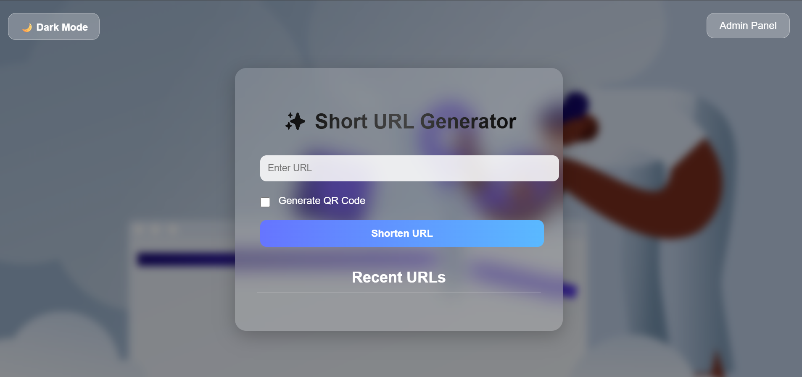
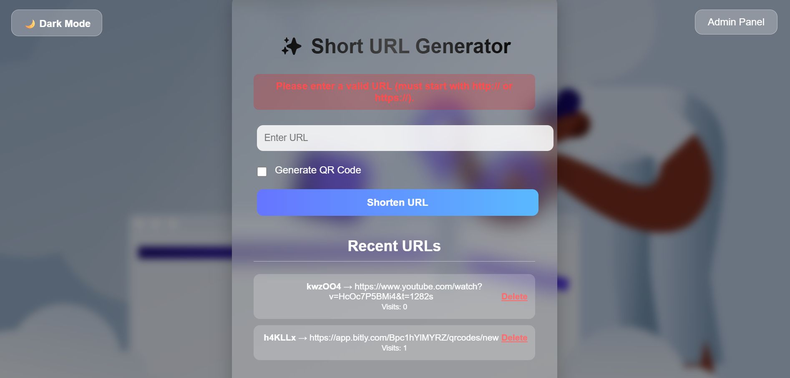
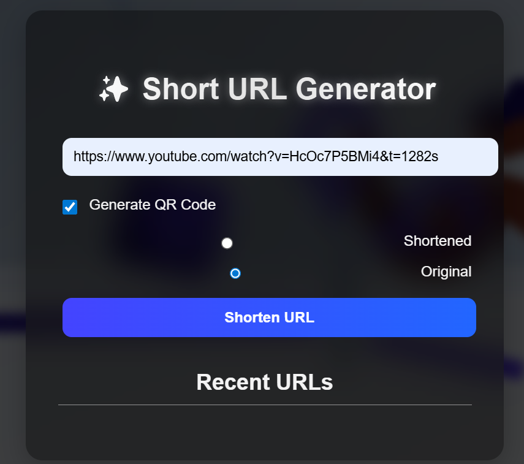
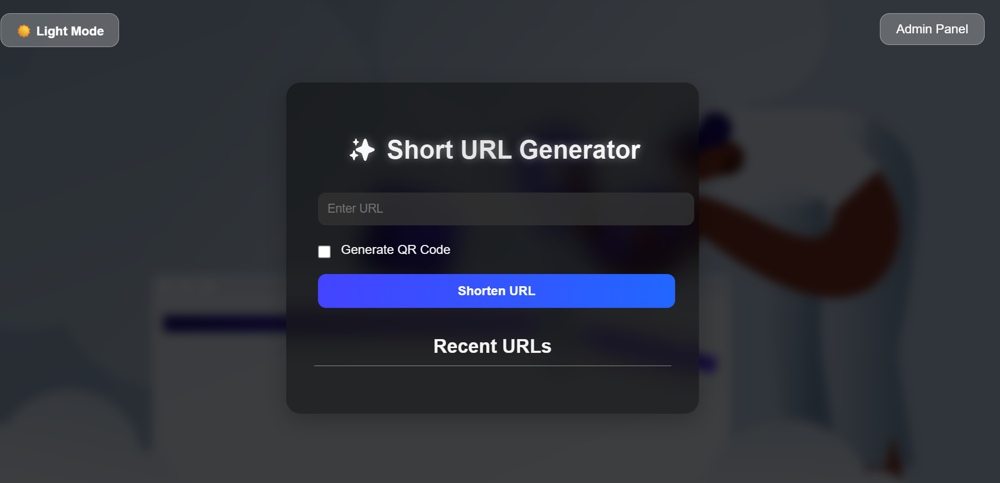
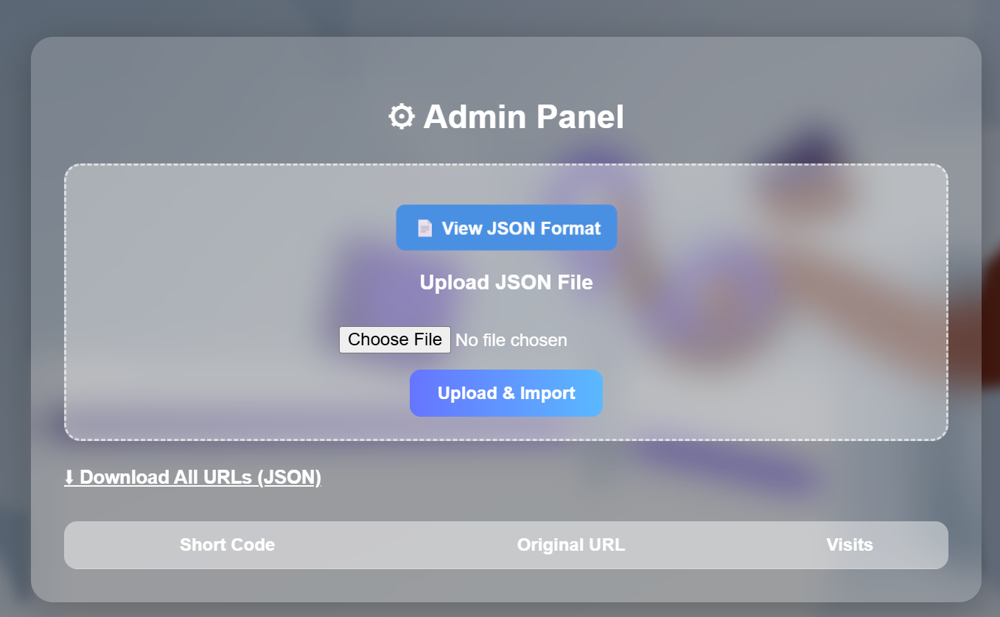
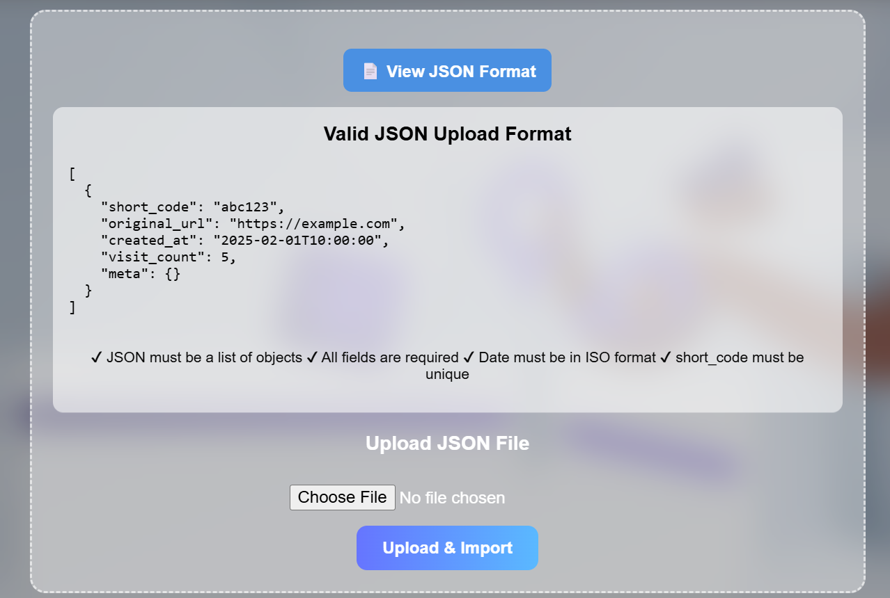
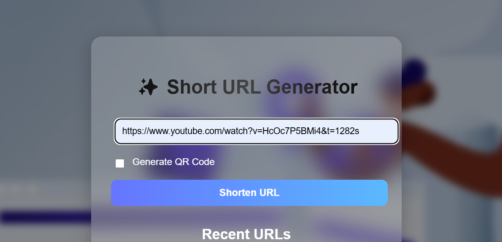
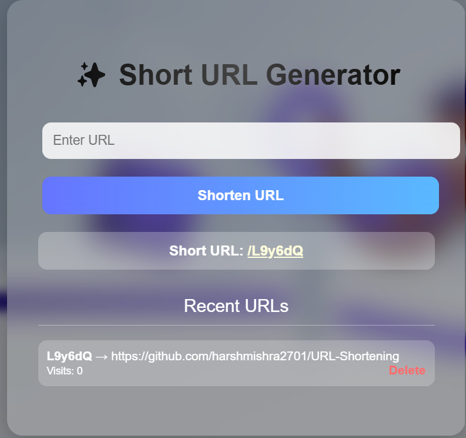
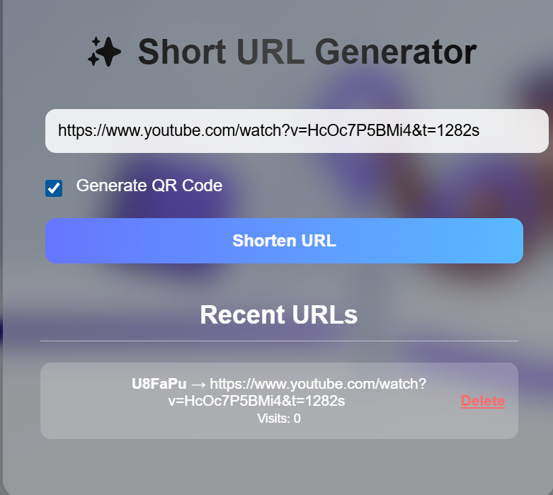
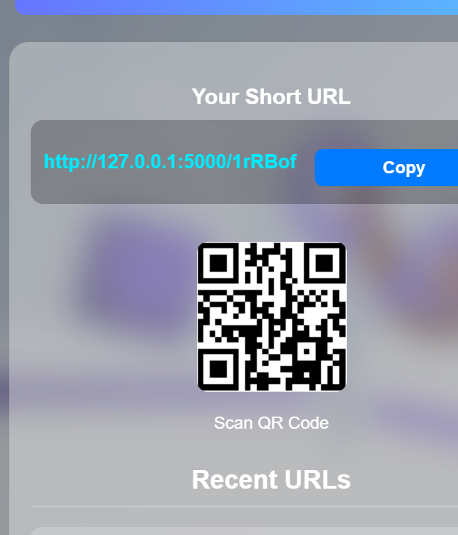

# 🔗 Short URL Generator

> A modern, Bitly-style URL shortening web application built with Flask & MongoDB


---

## 📌 Overview

**Short URL Generator** is a sleek, fast and modern URL shortening platform built using Flask and MongoDB.  
It converts long URLs into short, shareable links — just like Bitly.  

It supports:

- URL shortening  
- QR Code generation (Short URL or Original URL)  
- Visit counting  
- MongoDB database  
- JSON import/export (Admin Panel)  
- Input validation + sanitization  
- Light/Dark Mode with memory  
- Glassmorphism UI  
- Copy-to-clipboard button  
- Delete confirmation popup  

This project is perfect for learning **Flask**, **MongoDB**, **Web UI design**, and **clean backend development**.

---

## 🚀 Features

### 🔹 User Features

- Convert long URLs into short, unique codes  
- QR code generation (select **Short URL** or **Original URL**)  
- Clean Bitly-style result card  
- Copy button with animation  
- Smooth URL validation and sanitization  
- Auto Dark/Light Mode (saves preference)  
- Mobile-friendly QR Codes  
- Fully responsive design  

### 🔹 Admin Panel Features  

- View all shortened URLs  
- Delete URLs (with confirmation popup)  
- Import URLs using JSON file  
- Export database to JSON  
- Shows JSON format guide  
- Strict JSON validation  

---

## 🧠 Short Code Generation Algorithm

The app uses a **Random Alphanumeric Short Code Generator**.

### 🔍 Algorithm Details

- Uses Python’s `string.ascii_letters + string.digits`
- Randomly picks characters  
- Generates a 6-character short ID  
- Checks MongoDB to avoid duplicates  
- If duplicate → regenerate automatically  

### 🔢 Example  

```python
import random, string

def generate_code(length=6):
    chars = string.ascii_letters + string.digits
    return ''.join(random.choice(chars) for _ in range(length))
```

🗃️ Tech Stack

| Layer        | Technology                               |
| ------------ | ---------------------------------------- |
| Backend      | Flask (Python)                           |
| Database     | MongoDB                                  |
| Frontend     | HTML, CSS (Glassmorphism), Vanilla JS    |
| QR Generator | `qrserver.com` API                       |
| Hosting      | Local / PythonAnywhere / Render / Heroku |
| Component   | Technology                                |
| UI Style    | Glassmorphism, Gradient UI                |
| Data Format | JSON

📁 Project Folder Structure

URL_SHORTENING/
│── app.py
│── models.py
│── database.py
│── requirements.txt
│
├── instance/
│     └── urls.db
│
├── templates/
│     ├── index.html
│     └── admin.html
│
└── static/
      ├── style.css
      └── images/
            └── url_shortener_bg.jpg

## ⚙️ How to Run

Step 1: clone the Repo and create virtual environment

```sh
git clone <repo>.git
git checkout task/url-shortner

```

Step 2: Create virtual Environment and activate  it:

```sh
python -m venv .venv-dev
# Windows:
venv\Scripts\activate

# Mac/Linux:
source venv/bin/activate
```

✔️ Step 3 — Install Dependencies

```sh
pip install -r requirements.txt
```

create `.env` file and put the content from `.env-local` file

✔️ Step 4 — Run the Application

```sh
python app.py
```

You will see:

Running on <http://127.0.0.1:5000/>

Open your browser and visit:

👉 <http://127.0.0.1:5000/>  — User Panel
👉 <http://127.0.0.1:5000/admin>  — Admin Panel

## 🔗 How the App Works

▶️ User Flow

User enters a long URL

System sanitizes + validates input

Generates a unique short code

Saves it in MongoDB

Displays short URL + QR code

When someone clicks the short link → Visit count increases

User redirected to original URL

http://127.0.0.1:5000/abc123

Someone clicks it → visit count increases → redirected to original URL

## 🧩 Short Code Generation Algorithm

Uses characters: a–z, A–Z, 0–9

Random 6-character string

Ensures uniqueness by checking database

If code exists → generate again

Saves final unique code

🗄️ Database Schema (SQLAlchemy Model)

| Field        | Type      | Description        |
| ------------ | --------- | ------------------ |
| id           | Integer   | Primary Key        |
| short_code   | String    | Unique short ID    |
| original_url | String    | Long URL           |
| created_at   | DateTime  | Timestamp          |
| visit_count  | Integer   | Click count        |
| meta         | JSON Text | Title, notes, tags |

## 📦 JSON Import Format (Admin)

Example JSON file for bulk import:

```json
[
  {
    "short_code": "abc123",
    "original_url": "https://example.com",
    "created_at": "2025-11-18T23:59:00Z",
    "visit_count": 42,
    "meta": {
      "title": "Example Page",
      "notes": "Optional notes",
      "tags": ["test", "demo"]
    }
  }
]
```

📤 Export Format

Admin can download all URLs in the same JSON format.

Screenshots:
Home Page:
    
    
    
    
Admin Page:
    
    

Url Shortening:
    
    
    
    

📜License
[License](LICENSE)

👤Author
Harsh Mishra
